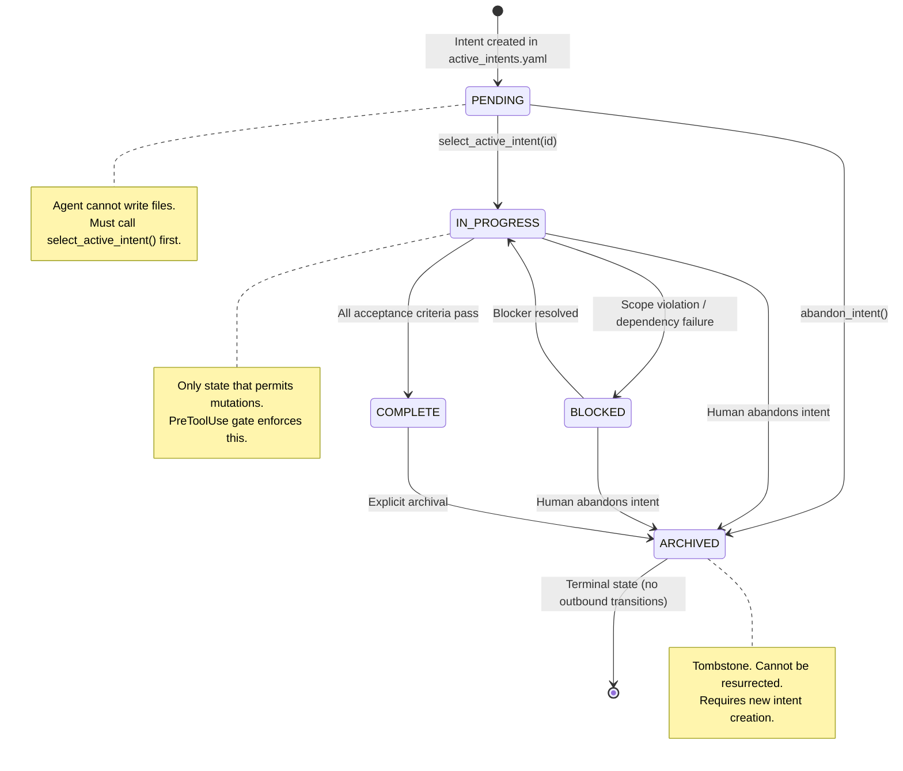
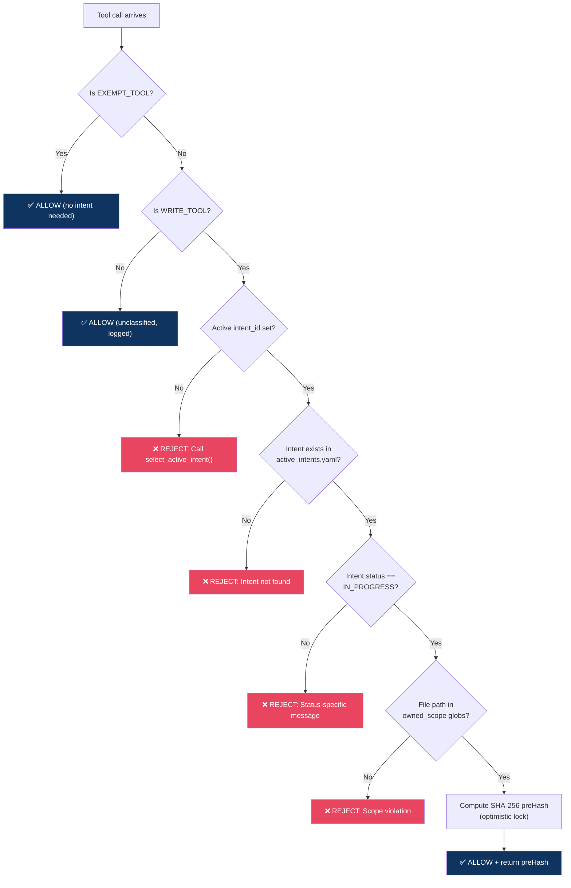
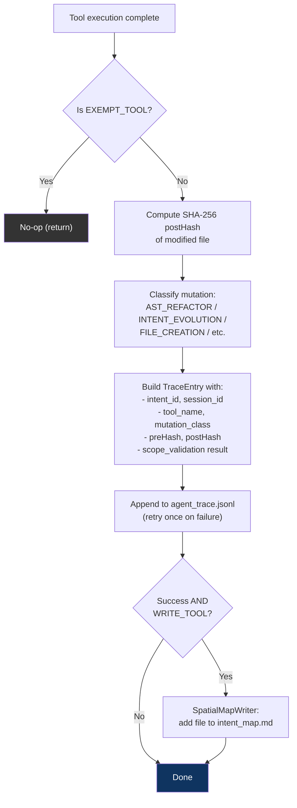
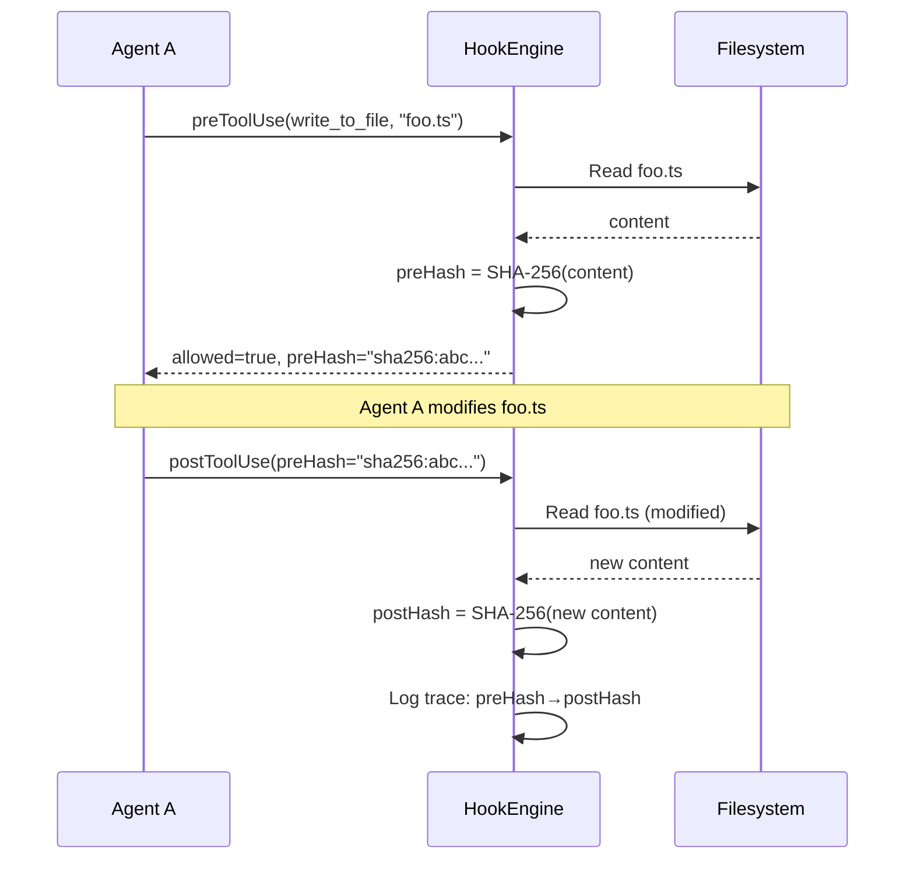
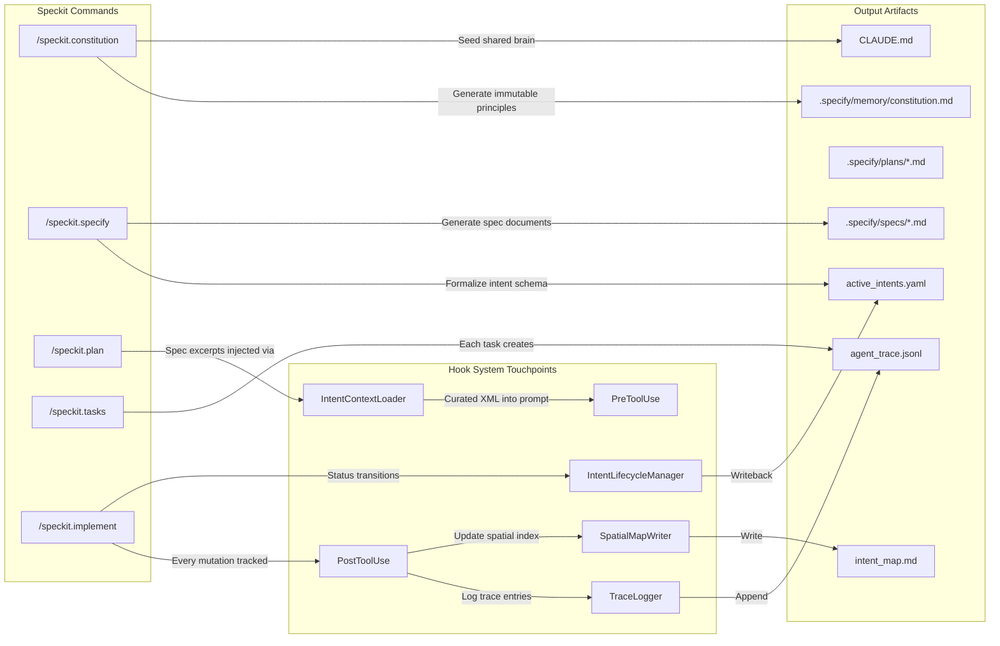

# ARCHITECTURE_NOTES.md

## Governed AI-Native IDE Extension — Hook Middleware Specification

**Version**: 3.0 (reflects implemented state as of 2026-02-20)
**Spec ID**: SPEC-003
**Governing Document**: `.specify/memory/constitution.md`

---

## 1. System Boundary Diagram

```mermaid
graph TB
    subgraph IDE["VS Code / Cursor IDE"]
        Agent["LLM Agent Session"]
        BaseTool["BaseTool.handle()"]
        SAI["SelectActiveIntentTool"]
    end

    subgraph HookSystem["Hook Middleware Layer"]
        HE["HookEngine<br/>(Singleton per workspace+session)"]
        Pre["PreToolUse Gate"]
        Post["PostToolUse Logger"]
        ICL["IntentContextLoader"]
        TL["TraceLogger"]
        IV["IntentValidator"]
        ILM["IntentLifecycleManager"]
        SMW["SpatialMapWriter"]
    end

    subgraph Sidecar[".orchestration/ Sidecar Files"]
        AI["active_intents.yaml"]
        AT["agent_trace.jsonl"]
        IM["intent_map.md"]
        CM["CLAUDE.md"]
    end

    subgraph SpecFiles[".specify/ Specification Files"]
        CON["memory/constitution.md"]
        SPECS["specs/*.md"]
        PLANS["plans/*.md"]
    end

    Agent -->|"1. select_active_intent(id)"| SAI
    SAI -->|"2. Load + validate intent"| ICL
    SAI -->|"2a. PENDING→IN_PROGRESS"| ILM
    ILM -->|"writeback"| AI
    ICL -->|"parse + validate"| IV
    ICL -->|"read"| AI
    ICL -->|"read spatial map"| IM
    ICL -->|"read specs"| SPECS
    SAI -->|"3. Set active intent"| HE

    Agent -->|"4. Tool call"| BaseTool
    BaseTool -->|"5. preToolUse()"| Pre
    Pre -->|"validate intent"| ICL
    Pre -->|"scope check"| AI
    Pre -->|"compute preHash"| Pre

    BaseTool -->|"6. execute()"| BaseTool
    BaseTool -->|"7. postToolUse()"| Post
    Post -->|"compute postHash"| Post
    Post -->|"classify mutation"| Post
    Post -->|"append trace"| TL
    TL -->|"write"| AT
    Post -->|"update spatial map"| SMW
    SMW -->|"write"| IM

    style HookSystem fill:#1a1a2e,stroke:#e94560,color:#fff
    style Sidecar fill:#0f3460,stroke:#16213e,color:#fff
    style SpecFiles fill:#533483,stroke:#16213e,color:#fff
```



---

## 2. Intent Lifecycle State Machine



### Transition Rules (Enforced by `IntentLifecycleManager`)

| From        | To          | Trigger                          | Gate                            |
| ----------- | ----------- | -------------------------------- | ------------------------------- |
| PENDING     | IN_PROGRESS | `select_active_intent(id)`       | Automatic on intent selection   |
| PENDING     | ARCHIVED    | `abandon_intent()`               | Human command                   |
| IN_PROGRESS | COMPLETE    | `verify_acceptance_criteria()`   | All criteria pass               |
| IN_PROGRESS | BLOCKED     | Scope violation / HITL rejection | Hook system                     |
| IN_PROGRESS | ARCHIVED    | Human abandons                   | Human command                   |
| BLOCKED     | IN_PROGRESS | `resolve_blocker()`              | Human expands scope or approves |
| BLOCKED     | ARCHIVED    | `abandon_intent()`               | Human command                   |
| COMPLETE    | ARCHIVED    | `archive_intent()`               | Explicit user command           |

### Prohibited Transitions

| From     | To          | Reason                            |
| -------- | ----------- | --------------------------------- |
| COMPLETE | IN_PROGRESS | Completed work is immutable       |
| COMPLETE | BLOCKED     | Cannot block completed work       |
| ARCHIVED | \*          | Terminal state — no resurrection  |
| \*       | PENDING     | PENDING is only the initial state |
| PENDING  | COMPLETE    | Must do work before completing    |
| PENDING  | BLOCKED     | Must start before blocking        |

---

## 3. Hook Middleware Specification

### 3.1 PreToolUse Hook

**Execution point**: `BaseTool.handle()`, before `this.execute(params, task, callbacks)`

**Validation chain** (short-circuits on first failure):



**Responsibilities detail**:

| Step                | Responsibility                                                                                                | On Failure                                          |
| ------------------- | ------------------------------------------------------------------------------------------------------------- | --------------------------------------------------- |
| 1. Exempt check     | Short-circuit read-only/meta tools                                                                            | N/A                                                 |
| 2. Intent existence | Verify `intent_id` resolves from `active_intents.yaml`                                                        | REJECT with guidance to call `select_active_intent` |
| 3. Status gate      | Only `IN_PROGRESS` permits mutations. PENDING/BLOCKED/COMPLETE/ARCHIVED each have specific rejection messages | REJECT with actionable message                      |
| 4. Scope validation | Match `filePath` against `intent.owned_scope[]` using glob patterns (`**`, `*`)                               | REJECT with scope violation message                 |
| 5. Optimistic lock  | Compute SHA-256 of file content pre-mutation. Returns `null` for new files                                    | Fail-open (log error, allow)                        |

**HITL Authorization Gate** (planned, not yet implemented):

- Destructive commands (`execute_command` with `rm`, `git push --force`, etc.) will trigger human confirmation
- Scope escalation requests will require human approval before amending `owned_scope`

### 3.2 PostToolUse Hook

**Execution point**: `BaseTool.handle()`, in `finally` block after `this.execute()` — runs regardless of success/failure.

**Processing chain**:



**Responsibilities detail**:

| Step                  | Responsibility                                          | Behavior                                                                                                                                                                |
| --------------------- | ------------------------------------------------------- | ----------------------------------------------------------------------------------------------------------------------------------------------------------------------- |
| 1. Post-hash          | SHA-256 of file after mutation                          | Returns `null` if file was deleted or doesn't exist                                                                                                                     |
| 2. Classify mutation  | Determine `MutationClass` from tool name and hash state | `preHash == null` → `FILE_CREATION`; `apply_diff`/`edit` → `AST_REFACTOR`; `write_to_file` with existing hash → `INTENT_EVOLUTION`; `execute_command` → `CONFIGURATION` |
| 3. Trace entry        | Serialize to Agent Trace Schema (see §4.2)              | UUID v4 for entry ID, ISO 8601 timestamp                                                                                                                                |
| 4. Append to ledger   | `fs.appendFile` to `agent_trace.jsonl`                  | Single retry on write failure; fail-open on double failure                                                                                                              |
| 5. Spatial map update | Add `filePath` to intent section in `intent_map.md`     | Deduplicates; creates section if missing; fail-open on error                                                                                                            |
| 6. Lessons Learned    | Append to `CLAUDE.md` on verification failure           | Planned — triggers when `postHash` diverges from expected                                                                                                               |

### 3.3 Context Injection (IntentContextLoader)

When `select_active_intent(id)` is called, the `IntentContextLoader` builds and injects an XML block:

```xml
<intent_context id="INT-001" name="Hook System" status="IN_PROGRESS" version="2">
  <scope>
    <pattern>src/core/hooks/**</pattern>
    <pattern>src/core/tools/SelectActiveIntentTool.ts</pattern>
  </scope>
  <constraints>
    <constraint>Must not break existing tool execution flow</constraint>
    <constraint>Must use optimistic locking for concurrency control</constraint>
  </constraints>
  <acceptance_criteria>
    <criterion>Hook engine intercepts all write tool executions</criterion>
    <criterion>Scope validation prevents out-of-scope modifications</criterion>
  </acceptance_criteria>
  <related_files>
    <file path="src/core/hooks/HookEngine.ts" />
    <file path="src/core/hooks/types.ts" />
  </related_files>
  <related_specs>
    <spec_excerpt>
      # Hook System Specification (first 2KB)...
    </spec_excerpt>
  </related_specs>
</intent_context>
```

**Context budget**: 16,384 bytes (~4,000 tokens). Truncation priority:

1. Trace entries (oldest dropped first)
2. Spec excerpts (each capped at 2KB, then dropped)
3. Related files (oldest dropped first)

---

## 4. Data Model: Sidecar Files

### 4.1 `active_intents.yaml` — Intent Specification

**Owner**: Machine-managed (Pre/Post-Hook updated)
**Schema**:

```yaml
# JSON Schema (conceptual)
active_intents:
    type: array
    items:
        type: object
        required: [id, name, status, owned_scope, constraints, acceptance_criteria, created_at, updated_at]
        properties:
            id:
                type: string
                pattern: "^[A-Z]+-\\d{3,}$"
                description: "Unique intent identifier (e.g., INT-001, FEAT-042)"
            name:
                type: string
                minLength: 3
                maxLength: 200
            status:
                type: string
                enum: [PENDING, IN_PROGRESS, COMPLETE, BLOCKED, ARCHIVED]
            version:
                type: integer
                minimum: 1
                default: 1
            owned_scope:
                type: array
                minItems: 1
                items:
                    type: string
                    description: "Glob pattern (e.g., src/core/hooks/**)"
            constraints:
                type: array
                items: { type: string }
            acceptance_criteria:
                type: array
                items: { type: string }
            related_specs:
                type: array
                items:
                    type: object
                    properties:
                        type:
                            enum: [speckit, github_issue, github_pr, constitution, external]
                        ref:
                            type: string
            parent_intent:
                type: [string, "null"]
                pattern: "^[A-Z]+-\\d{3,}$"
            tags:
                type: array
                items: { type: string }
            created_at:
                type: string
                format: date-time
            updated_at:
                type: string
                format: date-time
```

**Write triggers**:

- `IntentLifecycleManager.transitionIntent()` — status changes
- `IntentLifecycleManager.updateIntentField()` — field amendments
- `SelectActiveIntentTool` — PENDING→IN_PROGRESS on first selection

### 4.2 `agent_trace.jsonl` — Append-Only Audit Ledger

**Owner**: PostToolUse hook (append-only)
**Schema (one JSON object per line)**:

```json
{
	"id": "uuid-v4",
	"timestamp": "2026-02-20T14:30:00.000Z",
	"intent_id": "INT-001",
	"session_id": "session-abc-123",
	"tool_name": "write_to_file",
	"mutation_class": "INTENT_EVOLUTION",
	"file": {
		"relative_path": "src/core/hooks/HookEngine.ts",
		"pre_hash": "sha256:a1b2c3...",
		"post_hash": "sha256:d4e5f6..."
	},
	"scope_validation": "PASS",
	"success": true,
	"error": null
}
```

**Invariants**:

- Append-only — no entry is ever deleted or modified
- `file` is `null` for non-file tools (e.g., `execute_command` without a target)
- `pre_hash` is `null` for newly created files
- `post_hash` is `null` if the file was deleted or the tool failed
- `scope_validation` is one of: `PASS` (write tool in scope), `FAIL` (rejected), `EXEMPT` (non-write tool)
- Retry once on write failure; fail-open on double failure

**Mutation class taxonomy**:

| Class              | Trigger                                                     |
| ------------------ | ----------------------------------------------------------- |
| `FILE_CREATION`    | `preHash == null` (file didn't exist before)                |
| `FILE_DELETION`    | Tool is delete-type                                         |
| `AST_REFACTOR`     | `apply_diff`, `edit`, `search_and_replace` on existing file |
| `INTENT_EVOLUTION` | `write_to_file` on existing file                            |
| `CONFIGURATION`    | `execute_command`                                           |
| `BUG_FIX`          | (reserved — requires semantic analysis)                     |
| `DOCUMENTATION`    | (reserved — requires file extension heuristic)              |

### 4.3 `intent_map.md` — Spatial Index

**Owner**: SpatialMapWriter (PostToolUse), human-editable
**Purpose**: Business Intent → File Path mapping for context injection

**Format**:

```markdown
# Intent-Code Spatial Map

## INT-001: Intent-Code Traceability Hook System

### Core Components

- `src/core/hooks/HookEngine.ts` - Central coordinator
- `src/core/hooks/IntentContextLoader.ts` - Context management
- `src/core/hooks/TraceLogger.ts` - Audit logging

### Tool Integration

- `src/core/tools/SelectActiveIntentTool.ts` - Intent selection tool

## INT-002: Example Feature - Weather API

### Planned Structure

- `src/api/weather/` - API client

---

_This file is automatically updated by the hook system as intents evolve._
```

**Write triggers**:

- `SpatialMapWriter.addFileToIntent()` — called from PostToolUse on successful write
- `SpatialMapWriter.removeFileFromIntent()` — called on file deletion
- Auto-creates intent section if missing
- Deduplicates entries (no double-listing)

### 4.4 `CLAUDE.md` — Shared Brain

**Owner**: Human + Agent (coordinated writes)
**Purpose**: Persistent knowledge base for parallel agent sessions (Architect/Builder/Tester)

**Sections**:

- **Architectural Decisions**: Timestamped records of design choices with rationale
- **Lessons Learned**: Post-failure notes to prevent regression
- **Project-Specific Rules**: Code style, testing conventions
- **Known Issues**: Active bugs or technical debt
- **Future Enhancements**: Roadmap items

**Write triggers** (planned):

- PostToolUse appends "Lessons Learned" when verification failure detected (hash mismatch)
- Human appends architectural decisions and rules

---

## 5. Security & Authorization Model

### 5.1 Command Classification

| Classification           | Tools                                                                                                                                                                                                                           | Intent Required | Scope Enforced |
| ------------------------ | ------------------------------------------------------------------------------------------------------------------------------------------------------------------------------------------------------------------------------- | --------------- | -------------- |
| **Exempt** (read/meta)   | `read_file`, `list_files`, `search_files`, `codebase_search`, `ask_followup_question`, `attempt_completion`, `switch_mode`, `new_task`, `update_todo_list`, `select_active_intent`, `browser_action`, `skill`, `generate_image` | No              | No             |
| **Write** (mutating)     | `write_to_file`, `apply_diff`, `edit`, `search_and_replace`, `search_replace`, `edit_file`, `apply_patch`, `insert_code_block`                                                                                                  | Yes             | Yes            |
| **Unclassified** (other) | `execute_command`, custom tools                                                                                                                                                                                                 | No (logged)     | No             |

### 5.2 Scope Enforcement

```
owned_scope: ["src/core/hooks/**"]

Allowed:
  ✅ src/core/hooks/HookEngine.ts
  ✅ src/core/hooks/sub/deep/File.ts
  ✅ src/core/hooks/types.ts

Denied:
  ❌ src/core/tools/BaseTool.ts         → outside scope
  ❌ src/api/weather/client.ts           → different intent's scope
  ❌ .orchestration/active_intents.yaml  → unless in owned_scope
```

Glob matching uses a custom implementation (no external dependencies):

- `**` matches any number of path segments (including zero)
- `*` matches any characters within a single path segment
- Backslashes normalized to forward slashes

### 5.3 `.intentignore` Pattern (Planned)

Not yet implemented. When implemented:

- Files matching `.intentignore` patterns will be excluded from intent enforcement
- Similar to `.gitignore` syntax
- Use case: generated files, build artifacts, lock files

### 5.4 Optimistic Locking



**Conflict detection**: If another agent modifies `foo.ts` between preToolUse and postToolUse, the `preHash` in the trace entry won't match the file's actual pre-state when audited. This creates a detectable inconsistency in the trace ledger.

### 5.5 Error Protocol

All hook rejections return structured data via `formatResponse.toolError()`:

```typescript
interface HookResult {
	allowed: boolean // false = tool execution blocked
	reason?: string // Human-readable explanation for LLM self-correction
	preHash?: string // SHA-256 hash for optimistic locking
	metadata?: Record<string, unknown> // Additional context
}
```

**Fail-open principle**: If any hook component throws an unhandled exception, the tool executes normally and the error is logged to stderr. Governance gaps are preferable to blocked developers.

---

## 6. Speckit Command Integration Map



### Command-to-System Mapping

| Speckit Command         | Primary Output                                 | Hook System Integration                                                                                                                                                 |
| ----------------------- | ---------------------------------------------- | ----------------------------------------------------------------------------------------------------------------------------------------------------------------------- |
| `/speckit.constitution` | `.specify/memory/constitution.md`, `CLAUDE.md` | Constitution referenced via `related_specs` in intent; injected as context excerpt                                                                                      |
| `/speckit.specify`      | `active_intents.yaml`, `.specify/specs/*.md`   | `IntentValidator` validates schema on load; `IntentContextLoader` resolves `related_specs` entries                                                                      |
| `/speckit.plan`         | `.specify/plans/*.md`                          | Plan documents linked via `related_specs`; excerpts (first 2KB) injected into `<intent_context>` XML by `IntentContextLoader`                                           |
| `/speckit.tasks`        | Task breakdown (internal)                      | Each task execution logged to `agent_trace.jsonl` via PostToolUse; `mutation_class` captures the nature of each change                                                  |
| `/speckit.implement`    | Code changes                                   | Full hook chain: PreToolUse validates intent+scope → tool executes → PostToolUse hashes+traces+updates spatial map; `IntentLifecycleManager` handles status transitions |

---

## 7. Component Inventory

| Component                              | File                                       | Lines | Responsibility                                                               |
| -------------------------------------- | ------------------------------------------ | ----- | ---------------------------------------------------------------------------- |
| `HookEngine`                           | `src/core/hooks/HookEngine.ts`             | 277   | Singleton orchestrator. Manages intent state, dispatches pre/post hooks      |
| `IntentContextLoader`                  | `src/core/hooks/IntentContextLoader.ts`    | 287   | Parses YAML, validates intents, builds curated XML context, resolves specs   |
| `TraceLogger`                          | `src/core/hooks/TraceLogger.ts`            | ~90   | Creates trace entries, appends to JSONL, reads recent entries                |
| `IntentValidator`                      | `src/core/hooks/IntentValidator.ts`        | 169   | Schema validation for IntentSpec (errors) and optional fields (warnings)     |
| `IntentLifecycleManager`               | `src/core/hooks/IntentLifecycleManager.ts` | 116   | State machine transitions, YAML writeback with AST-preserving parser         |
| `SpatialMapWriter`                     | `src/core/hooks/SpatialMapWriter.ts`       | ~100  | Auto-updates intent_map.md on successful mutations, deduplicates             |
| `types.ts`                             | `src/core/hooks/types.ts`                  | 139   | All interfaces: IntentSpec, TraceEntry, HookResult, tool classification sets |
| `utils.ts`                             | `src/core/hooks/utils.ts`                  | ~120  | SHA-256 hashing, custom glob matcher, path utils, mutation classifier        |
| `BaseTool.ts` (modified)               | `src/core/tools/BaseTool.ts`               | —     | Integration point: wraps `execute()` with pre/post hook calls                |
| `SelectActiveIntentTool.ts` (modified) | `src/core/tools/SelectActiveIntentTool.ts` | —     | Entry point for intent selection; auto-transitions PENDING→IN_PROGRESS       |

### Test Coverage

| Test Suite                       | Tests   | Scope                                                                               |
| -------------------------------- | ------- | ----------------------------------------------------------------------------------- |
| `utils.test.ts`                  | 25      | Hashing, glob matching, path utils, mutation classification                         |
| `TraceLogger.test.ts`            | 10      | Entry creation, JSONL append, retry, read/filter                                    |
| `IntentContextLoader.test.ts`    | 8       | YAML parsing, context building, XML formatting, cache                               |
| `HookEngine.test.ts`             | 19      | Singleton, enable check, all status rejections, scope, optimistic lock, spatial map |
| `IntentValidator.test.ts`        | 23      | All required/optional field validation, file validation, duplicates                 |
| `SpatialMapWriter.test.ts`       | 6       | Add/dedup/create section/create file/remove                                         |
| `IntentLifecycleManager.test.ts` | 17      | All valid/prohibited transitions, YAML writeback, field updates                     |
| **Total**                        | **112** |                                                                                     |

---

## 8. Invariants (Constitution Cross-Reference)

| #   | Constitutional Principle | Enforcement Mechanism                                     | Component                                  |
| --- | ------------------------ | --------------------------------------------------------- | ------------------------------------------ |
| 1   | No Intent, No Write      | PreToolUse step 2: reject write tools without `intent_id` | `HookEngine.preToolUse()`                  |
| 2   | Hooks Are the Law        | `BaseTool.handle()` wraps every `execute()` with hooks    | `BaseTool.ts`                              |
| 3   | Spatial Independence     | SHA-256 content hashes, not line numbers                  | `utils.computeFileHash()`                  |
| 4   | Scope Is a Fence         | Glob matching against `owned_scope[]`                     | `HookEngine.preToolUse()` step 4           |
| 5   | Optimistic Locking       | preHash computed in PreToolUse, compared in audit         | `HookEngine.preToolUse()` step 5           |
| 6   | Context Is Curated       | 16KB budget, 3-tier truncation, XML injection             | `IntentContextLoader`                      |
| 7   | Trust Debt Repaid        | Every mutation → `agent_trace.jsonl` entry with hashes    | `TraceLogger` + `HookEngine.postToolUse()` |

---

## 9. Planned but Not Yet Implemented

| Feature                          | Spec Reference    | Description                                           |
| -------------------------------- | ----------------- | ----------------------------------------------------- |
| HITL Authorization Gate          | §3.1              | Block destructive commands pending human confirmation |
| `.intentignore`                  | §5.3              | Exclude paths from intent enforcement                 |
| CLAUDE.md Auto-Append            | §4.4              | Append "Lessons Learned" on verification failure      |
| Acceptance Criteria Verification | Lifecycle         | Automated check before COMPLETE transition            |
| Intent Decomposition             | SPEC-002 §5       | Hierarchical intent trees with parent_intent          |
| SQLite Backend                   | CLAUDE.md roadmap | Replace JSONL/YAML for better query performance       |
