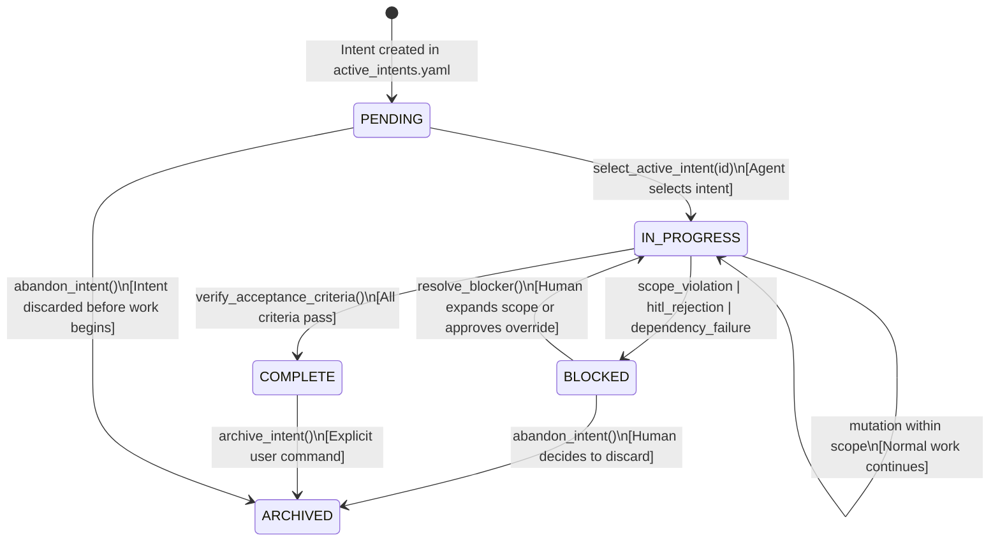
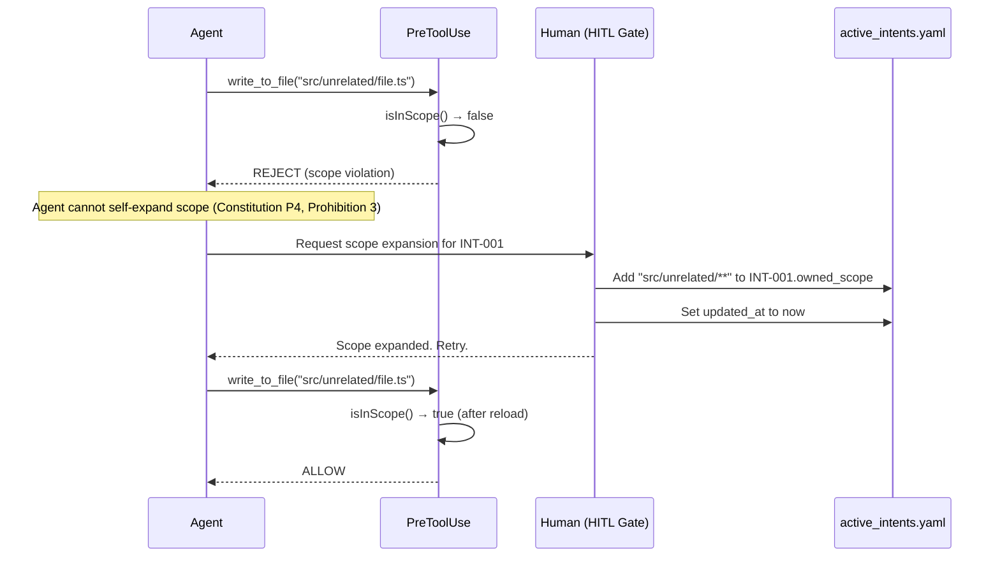

# Specification: Intent Formalization

## `/speckit.specify` — Intent Catalog, Lifecycle, and AST Correlation

**Spec ID**: SPEC-002
**Parent**: SPEC-001 (Hook System)
**Constitution**: `.specify/memory/constitution.md`
**Status**: DRAFT
**Created**: 2026-02-20

---

## 1. Intent Catalog Schema

### 1.1 Canonical YAML Schema

The authoritative definition of an intent lives in `.orchestration/active_intents.yaml`. Every field below is normative. Fields marked **REQUIRED** cause parse rejection if absent. Fields marked **OPTIONAL** default to the stated value.

```yaml
# .orchestration/active_intents.yaml
# JSON Schema: §1.2
# Governance: Constitution Principle 1 — No Intent, No Write

active_intents:
    - id: "INT-001" # REQUIRED. Unique. Pattern: /^[A-Z]+-\d{3,}$/
      name: "Intent-Code Traceability Hook System" # REQUIRED. Human-readable business requirement.
      status: "IN_PROGRESS" # REQUIRED. Enum: §2.1
      version: 1 # OPTIONAL. Default: 1. Monotonic. Bumped on INTENT_EVOLUTION.
      owned_scope: # REQUIRED. Non-empty array of workspace-relative globs.
          - "src/core/hooks/**"
          - "src/core/tools/SelectActiveIntentTool.ts"
          - ".orchestration/**"
      constraints: # REQUIRED. Natural-language rules the agent must obey.
          - "Must not break existing tool execution flow"
          - "Must be backward compatible with existing tasks"
          - "Must use optimistic locking for concurrency control"
      acceptance_criteria: # REQUIRED. Verifiable Definition of Done items.
          - "Hook engine intercepts all write tool executions"
          - "Scope validation prevents out-of-scope modifications"
          - "File modifications are logged to agent_trace.jsonl"
      related_specs: # OPTIONAL. Default: []. Links to external Speckit specs.
          - type: "speckit"
            ref: ".specify/specs/hook-system.spec.md"
          - type: "github_issue"
            ref: "https://github.com/RooCodeInc/Roo-Code/issues/42"
          - type: "constitution"
            ref: ".specify/memory/constitution.md"
      parent_intent: null # OPTIONAL. ID of parent intent for decomposition trees.
      tags: # OPTIONAL. Default: []. Free-form classification.
          - "governance"
          - "core-infrastructure"
      created_at: "2026-02-18T10:00:00Z" # REQUIRED. ISO 8601. Set once at creation.
      updated_at: "2026-02-18T14:00:00Z" # REQUIRED. ISO 8601. Updated on any field mutation.
```

### 1.2 JSON Schema (Formal Validation)

```yaml
# Intent Validation Schema (expressed as YAML for readability; machine form is JSON Schema Draft 2020-12)

$schema: "https://json-schema.org/draft/2020-12/schema"
title: "ActiveIntentsFile"
type: object
required: ["active_intents"]
properties:
    active_intents:
        type: array
        items:
            $ref: "#/$defs/IntentSpec"

$defs:
    IntentSpec:
        type: object
        required:
            ["id", "name", "status", "owned_scope", "constraints", "acceptance_criteria", "created_at", "updated_at"]
        additionalProperties: false
        properties:
            id:
                type: string
                pattern: "^[A-Z]+-\\d{3,}$"
                description: "Unique identifier. Convention: PREFIX-NNN where PREFIX is a project-specific namespace."
            name:
                type: string
                minLength: 3
                maxLength: 200
                description: "Human-readable business requirement or feature name."
            status:
                type: string
                enum: ["PENDING", "IN_PROGRESS", "BLOCKED", "COMPLETE", "ARCHIVED"]
                description: "Current lifecycle state. See §2 for valid transitions."
            version:
                type: integer
                minimum: 1
                default: 1
                description: "Monotonically increasing. Bumped on INTENT_EVOLUTION mutations."
            owned_scope:
                type: array
                minItems: 1
                items:
                    type: string
                    description: "Workspace-relative glob pattern (supports ** and *)."
                description: "Files this intent is authorized to mutate. Enforced by PreToolUse hook."
            constraints:
                type: array
                items:
                    type: string
                    minLength: 5
                description: "Natural-language rules. Injected into agent context on intent selection."
            acceptance_criteria:
                type: array
                items:
                    type: string
                    minLength: 5
                description: "Verifiable conditions for completion. Each must be testable."
            related_specs:
                type: array
                default: []
                items:
                    $ref: "#/$defs/SpecReference"
                description: "Links to Speckit specs, GitHub issues, or constitution clauses."
            parent_intent:
                type: ["string", "null"]
                default: null
                pattern: "^[A-Z]+-\\d{3,}$"
                description: "Parent intent ID for hierarchical decomposition."
            tags:
                type: array
                default: []
                items:
                    type: string
                description: "Free-form classification labels."
            created_at:
                type: string
                format: "date-time"
            updated_at:
                type: string
                format: "date-time"

    SpecReference:
        type: object
        required: ["type", "ref"]
        properties:
            type:
                type: string
                enum: ["speckit", "github_issue", "github_pr", "constitution", "external"]
            ref:
                type: string
                description: "File path (for speckit/constitution) or URL (for github_issue/external)."
```

### 1.3 Field Semantics

| Field                 | Semantics                                                                                                                                | Enforcement Point                            |
| --------------------- | ---------------------------------------------------------------------------------------------------------------------------------------- | -------------------------------------------- |
| `id`                  | Globally unique within the workspace. Referenced by `select_active_intent()`, trace entries, and spatial map.                            | IntentContextLoader.getIntent()              |
| `name`                | Displayed to humans and injected into agent system prompt. Must describe the _business_ requirement, not the implementation.             | formatContextForPrompt()                     |
| `status`              | Governs which operations are permitted. See §2.                                                                                          | PreToolUse validation chain step 3           |
| `version`             | Tracks semantic evolution. An AST_REFACTOR does not bump version. An INTENT_EVOLUTION does.                                              | PostToolUse trace entry                      |
| `owned_scope`         | The fence (Constitution P4). Glob patterns matched by `isInScope()`. A write outside these patterns is a hard rejection.                 | PreToolUse validation chain step 4           |
| `constraints`         | Injected into `<intent_context>` XML. The agent reads these as system-level instructions, not suggestions.                               | IntentContextLoader.formatContextForPrompt() |
| `acceptance_criteria` | Each item maps to a verifiable test. An intent transitions to COMPLETE only when all criteria are verified.                              | Human or CI verification                     |
| `related_specs`       | Traceability links. Speckit commands read these to inject plan context into Pre-Hook.                                                    | Speckit integration (§4)                     |
| `parent_intent`       | Enables decomposition: INT-001 may have children INT-001-A, INT-001-B. Children inherit parent constraints unless explicitly overridden. | IntentContextLoader (future)                 |

---

## 2. Intent Lifecycle

### 2.1 State Definitions

| State         | Meaning                                                                                       | Permitted Operations                                                                                     |
| ------------- | --------------------------------------------------------------------------------------------- | -------------------------------------------------------------------------------------------------------- |
| `PENDING`     | Intent is specified but work has not begun. No agent has selected it.                         | Read-only exploration. No mutations allowed even if scope matches.                                       |
| `IN_PROGRESS` | An agent has called `select_active_intent()` against this intent. Work is actively happening. | All write tools within `owned_scope`. Trace entries are appended.                                        |
| `BLOCKED`     | A scope violation, HITL rejection, or dependency failure has halted progress.                 | Read-only. Agent may inspect files but not mutate them. Must resolve blocker to return to IN_PROGRESS.   |
| `COMPLETE`    | All `acceptance_criteria` have been verified. No further mutations expected.                  | Read-only. PreToolUse rejects writes against COMPLETE intents.                                           |
| `ARCHIVED`    | Intent is permanently retired. May have been completed, abandoned, or superseded.             | No operations. Intent is retained in YAML for traceability but is invisible to `select_active_intent()`. |

### 2.2 State Transition Diagram



### 2.3 Transition Rules

Each transition has a **trigger**, **guard condition**, and **side effect**.

| Transition                | Trigger                                      | Guard                                             | Side Effect                                                                                        |
| ------------------------- | -------------------------------------------- | ------------------------------------------------- | -------------------------------------------------------------------------------------------------- |
| PENDING → IN_PROGRESS     | `select_active_intent(id)`                   | Intent exists, status is PENDING                  | `updated_at` set to now. HookEngine state → ACTIVE. Context injected into agent.                   |
| IN_PROGRESS → IN_PROGRESS | Any successful mutation                      | Intent is active, file in scope                   | Trace entry appended. `updated_at` set to now.                                                     |
| IN_PROGRESS → COMPLETE    | `verify_acceptance_criteria()` (human or CI) | All `acceptance_criteria` items verified          | `status` set to COMPLETE. `updated_at` set to now. Trace entry with mutation_class: DOCUMENTATION. |
| IN_PROGRESS → BLOCKED     | PreToolUse scope rejection OR HITL rejection | Scope violation detected or human denies approval | `status` set to BLOCKED. `updated_at` set to now. Trace entry with scope_validation: FAIL.         |
| BLOCKED → IN_PROGRESS     | `resolve_blocker()` (human action)           | Human expands `owned_scope` or approves override  | `status` set to IN_PROGRESS. `owned_scope` may be amended. `updated_at` set to now.                |
| BLOCKED → ARCHIVED        | `abandon_intent()` (human command)           | Human explicitly abandons                         | `status` set to ARCHIVED. `updated_at` set to now.                                                 |
| COMPLETE → ARCHIVED       | `archive_intent()` (human command)           | Human explicitly archives                         | `status` set to ARCHIVED. `updated_at` set to now.                                                 |
| PENDING → ARCHIVED        | `abandon_intent()` (human command)           | Human discards before work begins                 | `status` set to ARCHIVED. `updated_at` set to now.                                                 |

### 2.4 Prohibited Transitions

The following transitions are **illegal** and must be enforced by the system:

| From     | To          | Reason                                                                                                                           |
| -------- | ----------- | -------------------------------------------------------------------------------------------------------------------------------- |
| COMPLETE | IN_PROGRESS | Completed work cannot be reopened. Create a new intent that references the completed one via `parent_intent` or `related_specs`. |
| ARCHIVED | Any         | Archived intents are tombstones. They exist only for traceability.                                                               |
| PENDING  | COMPLETE    | Cannot complete work that was never started.                                                                                     |
| PENDING  | BLOCKED     | Cannot be blocked before work begins.                                                                                            |
| Any      | PENDING     | PENDING is an initial state only. An intent that has progressed cannot regress to PENDING.                                       |

### 2.5 Status and PreToolUse Interaction

The PreToolUse validation chain (SPEC-001, §2.2) uses intent status as follows:

```
Step 3: Intent Validity Check

  match intent.status:
    PENDING       → REJECT ("Intent is PENDING. Call select_active_intent to activate it.")
    IN_PROGRESS   → ALLOW  (proceed to scope validation)
    BLOCKED       → REJECT ("Intent is BLOCKED. Resolve the blocker before continuing.")
    COMPLETE      → REJECT ("Intent is COMPLETE. No further mutations allowed.")
    ARCHIVED      → REJECT ("Intent is ARCHIVED and cannot be selected.")
```

This means only `IN_PROGRESS` intents permit write operations. The `select_active_intent` tool transitions PENDING → IN_PROGRESS as a side effect.

---

## 3. Intent-AST Correlation Rules

### 3.1 Mutation Classification

Every code change traced by the PostToolUse hook is classified into a `MutationClass`. This classification governs how the change relates to the governing intent.

| MutationClass      | Definition                                                                                                       | Intent Effect                                              | Version Effect        |
| ------------------ | ---------------------------------------------------------------------------------------------------------------- | ---------------------------------------------------------- | --------------------- |
| `AST_REFACTOR`     | Syntax or structure changes that preserve semantic behavior. Rename variable, extract function, reorder imports. | `intent_id` unchanged                                      | `version` unchanged   |
| `INTENT_EVOLUTION` | New behavior, new feature, or changed business logic. The code does something it didn't do before.               | `intent_id` unchanged OR new child intent created          | `version` bumped by 1 |
| `BUG_FIX`          | Correction of a defect. Code was supposed to do X but did Y; now it does X.                                      | `intent_id` unchanged                                      | `version` unchanged   |
| `DOCUMENTATION`    | Comments, docstrings, README changes. No executable code modified.                                               | `intent_id` unchanged                                      | `version` unchanged   |
| `CONFIGURATION`    | Config files, build scripts, CI/CD pipelines. Non-application code.                                              | `intent_id` unchanged                                      | `version` unchanged   |
| `FILE_CREATION`    | A new file is introduced. `preHash` is null.                                                                     | `intent_id` unchanged (file added to intent's spatial map) | `version` unchanged   |
| `FILE_DELETION`    | A file is removed. `postHash` is null.                                                                           | `intent_id` unchanged (file removed from spatial map)      | `version` unchanged   |

### 3.2 Correlation Invariants

These invariants hold for every trace entry and can be audited:

**Invariant 1: Intent Stability under Refactoring**

```
IF mutation_class == AST_REFACTOR:
    THEN trace.intent_id == active_intent.id
    AND  active_intent.version is unchanged
    AND  trace.file.pre_hash != trace.file.post_hash   (content changed)
    AND  semantic behavior is preserved                  (human-verifiable)
```

An AST_REFACTOR changes the shape of code but not its meaning. The intent that governs the code remains the same. The content hash changes because the bytes changed. The intent version does not change because the _business requirement_ is unchanged.

**Invariant 2: Intent Evolution requires Version Bump**

```
IF mutation_class == INTENT_EVOLUTION:
    THEN active_intent.version SHOULD be bumped by 1 in active_intents.yaml
    OR   a new child intent is created with parent_intent == active_intent.id
```

When code gains new behavior, the intent either evolves (version bump) or spawns a sub-intent. This ensures that the trace ledger can distinguish between "the same intent, refined" and "a fundamentally new requirement."

**Invariant 3: Scope Boundary Enforcement**

```
FOR EVERY trace_entry WHERE scope_validation == "PASS":
    THEN isInScope(trace_entry.file.relative_path, active_intent.owned_scope) == true
```

Every trace entry that passed scope validation is independently verifiable. Given the intent's `owned_scope` globs and the file's relative path, the `isInScope()` function must return `true`. If it does not, the trace entry is inconsistent and the hook system has a bug.

**Invariant 4: Hash Chain Integrity**

```
FOR EVERY consecutive pair (entry_N, entry_N+1) WHERE entry_N.file == entry_N+1.file:
    THEN entry_N.file.post_hash == entry_N+1.file.pre_hash
    OR   an external modification occurred between entries (flagged in trace)
```

The post-mutation hash of one entry should equal the pre-mutation hash of the next entry touching the same file. If they differ, an untraced modification occurred — either a human edit, a parallel agent, or a tool that bypassed hooks. The gap is detectable.

### 3.3 Spatial Map Correlation

The spatial map (`.orchestration/intent_map.md`) maintains a human-readable index of which files belong to which intents. The correlation rules are:

```
File F is correlated to Intent I IF AND ONLY IF:
    1. F matches at least one glob in I.owned_scope
    AND
    2. There exists at least one trace entry WHERE:
        trace.intent_id == I.id
        AND trace.file.relative_path == F
        AND trace.success == true
```

A file appears in the spatial map only after it has been successfully modified under an intent. Declaring a file in `owned_scope` does not automatically add it to the map — the intent must _touch_ the file.

### 3.4 Scope Expansion Protocol

When an agent needs to modify a file outside the active intent's `owned_scope`:



The critical constraint: **the agent cannot modify `active_intents.yaml` to expand its own scope** unless the intent's `owned_scope` already includes `.orchestration/**`. This is the self-referential governance loop that prevents scope escalation.

---

## 4. Speckit Integration Points

### 4.1 Integration Map

| Speckit Command         | Hook System Touchpoint           | Data Flow                                                                                                                                   |
| ----------------------- | -------------------------------- | ------------------------------------------------------------------------------------------------------------------------------------------- |
| `/speckit.constitution` | None (one-time bootstrap)        | Produces `.specify/memory/constitution.md`. Referenced by intents via `related_specs`.                                                      |
| `/speckit.specify`      | IntentContextLoader              | Produces spec files in `.specify/specs/`. Linked to intents via `related_specs[type=speckit]`.                                              |
| `/speckit.plan`         | **PreToolUse context injection** | Plan output is loaded by IntentContextLoader when the intent's `related_specs` reference a plan file. Injected into `<intent_context>` XML. |
| `/speckit.tasks`        | Intent decomposition             | Tasks map to child intents via `parent_intent`. Each task becomes a sub-intent with its own `owned_scope`.                                  |
| `/speckit.implement`    | **PostToolUse trace logging**    | Every file mutation during implementation is appended to `agent_trace.jsonl` with the active intent's ID.                                   |

### 4.2 PreToolUse: Plan Context Injection

When an intent has `related_specs` entries of type `speckit`, the `IntentContextLoader.buildIntentContext()` method resolves those references and includes relevant plan excerpts in the curated context.

```
IntentContextLoader.buildIntentContext("INT-001"):
    1. Load intent spec from active_intents.yaml
    2. FOR EACH related_specs entry WHERE type == "speckit":
        a. Read the referenced .specify/ file
        b. Extract: acceptance criteria, constraints, architecture notes
        c. Append to context (subject to 16KB token budget)
    3. Load spatial map entries
    4. Load recent trace entries
    5. Truncate to budget (traces first, then files, then spec excerpts)
    6. Return IntentContext
```

The plan becomes part of the agent's working memory — not as a dump, but as curated constraints that shape tool execution decisions.

### 4.3 PostToolUse: Implementation Trace

During `/speckit.implement`, every tool execution produces a trace entry:

```jsonl
{"id":"a1b2c3","timestamp":"2026-02-20T14:30:00Z","intent_id":"INT-001","session_id":"session-abc","tool_name":"write_to_file","mutation_class":"FILE_CREATION","file":{"relative_path":"src/core/hooks/HookEngine.ts","pre_hash":null,"post_hash":"sha256:9f86d..."},"scope_validation":"PASS","success":true}
{"id":"d4e5f6","timestamp":"2026-02-20T14:30:05Z","intent_id":"INT-001","session_id":"session-abc","tool_name":"apply_diff","mutation_class":"AST_REFACTOR","file":{"relative_path":"src/core/tools/BaseTool.ts","pre_hash":"sha256:a3c1e...","post_hash":"sha256:7b2f4..."},"scope_validation":"PASS","success":true}
```

This trace is the **cryptographic receipt** for the implementation. Given the trace, a verifier can:

1. Confirm every file touched was in the intent's `owned_scope`
2. Confirm the pre/post hashes form a consistent chain
3. Confirm the mutation classes are reasonable for the intent's purpose
4. Confirm no files outside scope were modified

### 4.4 Constitution Violation: HITL Authorization Gate

When the hook system detects a constitution violation, the agent is blocked and a human must intervene.

| Violation                | Detection Point             | HITL Action Required                                                              |
| ------------------------ | --------------------------- | --------------------------------------------------------------------------------- |
| Write without intent     | PreToolUse step 2           | Human must instruct agent to call `select_active_intent()` or create a new intent |
| Scope violation          | PreToolUse step 4           | Human must expand `owned_scope` in `active_intents.yaml` or reject the operation  |
| Write to COMPLETE intent | PreToolUse step 3           | Human must create a new intent for the additional work                            |
| Hash chain break         | PostToolUse audit           | Human must investigate the gap (external edit? parallel agent?) and reconcile     |
| Optimistic lock conflict | PostToolUse hash comparison | Human or agent must re-read the file and resolve the conflict                     |

The HITL gate is not optional. When the hook system rejects a tool execution, the agent receives a `toolError` response explaining the violation. The agent's only recourse is to either:

- Select a different (valid) intent
- Request the human to amend the intent specification
- Abandon the operation

The agent **cannot** override the hook system. This is Constitutional Prohibition 3: _"No scope escalation without intent amendment."_

---

## 5. Intent Decomposition

### 5.1 Hierarchical Intent Trees

Complex features decompose into parent-child intent trees:

```
INT-001: Intent-Code Traceability Hook System (parent)
├── INT-001-A: HookEngine Core (child)
│   owned_scope: ["src/core/hooks/HookEngine.ts", "src/core/hooks/types.ts"]
├── INT-001-B: IntentContextLoader (child)
│   owned_scope: ["src/core/hooks/IntentContextLoader.ts"]
├── INT-001-C: TraceLogger (child)
│   owned_scope: ["src/core/hooks/TraceLogger.ts", ".orchestration/agent_trace.jsonl"]
├── INT-001-D: BaseTool Integration (child)
│   owned_scope: ["src/core/tools/BaseTool.ts"]
└── INT-001-E: Test Suite (child)
    owned_scope: ["src/core/hooks/__tests__/**"]
```

### 5.2 Decomposition Rules

1. **Scope Partitioning**: Child intent scopes must be subsets of the parent's `owned_scope`. A child cannot own files the parent does not own.
2. **Scope Disjointness**: Sibling intents should have non-overlapping `owned_scope` where possible. Overlap creates contention zones requiring optimistic locking.
3. **Constraint Inheritance**: Children inherit all parent constraints unless explicitly overridden. A child may add constraints but not remove parent constraints.
4. **Acceptance Roll-up**: Parent intent is COMPLETE only when all children are COMPLETE and the parent's own `acceptance_criteria` are verified.

### 5.3 Parallel Agent Assignment

Decomposed intents enable parallel agent execution:

```mermaid
gantt
    title Parallel Agent Execution with Decomposed Intents
    dateFormat X
    axisFormat %s

    section Agent A
    INT-001-A HookEngine Core       :a1, 0, 30
    INT-001-D BaseTool Integration   :a2, after a1, 15

    section Agent B
    INT-001-B IntentContextLoader    :b1, 0, 20
    INT-001-C TraceLogger            :b2, after b1, 15

    section Agent C
    INT-001-E Test Suite             :c1, 20, 35
```



Each agent selects its assigned child intent. Scope disjointness ensures no conflicts. The shared brain (`.orchestration/CLAUDE.md`) prevents architectural drift.

---

## 6. AISpec Compatibility

### 6.1 Mapping to AISpec Patterns

This intent formalization is designed for compatibility with [AISpec](https://github.com/cbora/aispec) patterns:

| AISpec Concept       | Our Implementation                                     |
| -------------------- | ------------------------------------------------------ |
| Specification        | `active_intents.yaml` entry + `.specify/specs/*.md`    |
| Constraint           | `intent.constraints[]` — natural-language rules        |
| Acceptance Criterion | `intent.acceptance_criteria[]` — verifiable DoD items  |
| Scope                | `intent.owned_scope[]` — glob patterns                 |
| Trace                | `agent_trace.jsonl` — JSONL ledger with content hashes |
| Context Window       | `IntentContext` — curated ≤16KB payload                |

### 6.2 Mapping to Agent Trace Specification

Our `TraceEntry` schema aligns with [Agent Trace](https://github.com/entire-io/agent-trace):

| Agent Trace Field                               | Our Field                  | Notes                             |
| ----------------------------------------------- | -------------------------- | --------------------------------- |
| `id`                                            | `trace.id`                 | UUID v4                           |
| `timestamp`                                     | `trace.timestamp`          | ISO 8601                          |
| `files[].relative_path`                         | `trace.file.relative_path` | Workspace-relative                |
| `files[].conversations[].ranges[].content_hash` | `trace.file.post_hash`     | SHA-256, `sha256:` prefixed       |
| `files[].conversations[].related[].value`       | `trace.intent_id`          | Links mutation to business intent |
| `mutation_class`                                | `trace.mutation_class`     | Enum: §3.1                        |

---

## 7. Validation Checklist

Before this specification is approved, verify:

- [ ] Schema (§1.2) validates the current `active_intents.yaml` without errors
- [ ] All five lifecycle states (§2.1) are represented in the implemented `IntentStatus` type
- [ ] Prohibited transitions (§2.4) are enforced by PreToolUse validation
- [ ] Mutation classification (§3.1) matches the implemented `MutationClass` type
- [ ] Hash chain invariant (§3.2, Invariant 4) is testable against `agent_trace.jsonl`
- [ ] Speckit integration points (§4) are compatible with existing IntentContextLoader
- [ ] Scope expansion protocol (§3.4) does not allow agent self-escalation

---

_End of specification. Awaiting approval before proceeding to `/speckit.plan`._
