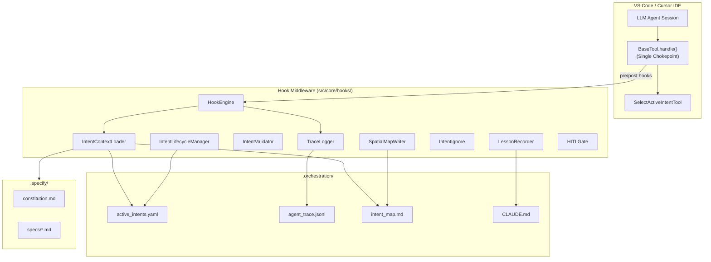

# Detailed Report: Architecting the AI-Native IDE & Intent-Code Traceability

**Project**: Roo-Code (Governed AI-Native IDE Extension)  
**Intent**: INT-001 — Intent-Code Traceability Hook System  
**Report Date**: February 2026  
**Spec Version**: ARCHITECTURE_NOTES.md v3.0, Constitution 2026-02-20

---

## Executive Summary

### Purpose and Vision

This report documents the **Intent-Code Traceability Hook System** (INT-001) implemented within Roo-Code. The system transforms the AI coding assistant into a **governed AI-Native IDE** where every code mutation is traceable to a declared business intent, every file write is cryptographically verifiable, and no agent can operate outside its sanctioned scope. Traditional version control (Git) answers _what_ changed and _when_; this system answers _why_ (intent) and _where_ (owned scope).

### Problem Addressed

AI-assisted development often leaves code changes disconnected from requirements. Agents modify files without a clear link to business intent, leading to audit gaps, scope drift, parallel conflicts, and lack of cryptographic verification that mutations match declared intent.

### Solution Overview

A **hook middleware layer** intercepts every tool execution at a single chokepoint: `BaseTool.handle()`. PreToolUse and PostToolUse hooks enforce the constitutional invariant:

```
intent_id → scope_validation → mutation → content_hash → audit_entry
```

Before any write, the agent must call `select_active_intent(intent_id)`. The system validates scope, applies optimistic locking via content hashes, and logs every mutation to an append-only audit ledger.

### Architecture at a Glance

- **IDE layer**: LLM agent, BaseTool.handle() (single chokepoint), SelectActiveIntentTool
- **Hook layer**: HookEngine, IntentContextLoader, TraceLogger, IntentValidator, IntentLifecycleManager, SpatialMapWriter, IntentIgnore, LessonRecorder, HITLGate
- **Sidecar files**: active_intents.yaml, agent_trace.jsonl, intent_map.md, CLAUDE.md, .intentignore
- **Specs**: Constitution, specs, plans under .specify/

### Core Mechanisms

**PreToolUse (gate)**: Exempt tools pass through; destructive tools require HITL; write tools require active intent, IN_PROGRESS status, path in owned_scope; pre-mutation hash for optimistic locking; stale-file detection rejects concurrent overwrites.

**PostToolUse (logger)**: Computes post-hash, classifies mutation, appends to agent_trace.jsonl (Agent Trace spec format), updates intent_map.md, records lessons to CLAUDE.md on failures.

### Deliverables and Completion Status

All **26 tasks** complete across 5 phases (Archaeological Dig, Handshake, Hook Middleware, Traceability, Parallel Orchestration) plus cross-cutting work. **161 unit tests** across 13 test files.

### Key Achievements

Intent formalization, single chokepoint, scope enforcement, content hashing (spatial independence), Agent Trace spec adoption, HITL for destructive tools, fail-open design, opt-in activation when .orchestration/ exists.

### Governance Principles

No Intent No Write; Hooks Are the Law; Spatial Independence (hashes over line numbers); Scope Is a Fence; Optimistic Locking; Context Is Curated; Trust Debt Repaid (every mutation logged).

### Technical Highlights

Intent lifecycle state machine; session coordination for parallel agents; LessonRecorder for scope violations and hash mismatches; .intentignore for exemptions.

### Planned but Not Implemented

Intent decomposition (parent_intent); SQLite backend for trace queries.

**Recently implemented:** Acceptance criteria verification via `verify_acceptance_criteria` tool (IN_PROGRESS → COMPLETE transition).

### Conclusion

The Intent-Code Traceability system is fully implemented and operational, providing cryptographic auditability and scope governance without blocking developer productivity. Fail-open and opt-in design ensure backward compatibility.

---

## Part 1: Implementation Architecture & Schemas

This section describes the **structural design** of the Intent-Code Traceability system: layers, components, data schemas, type definitions, and integration points. It answers _what_ the system is made of and _how_ those parts are organized.

---

### 1.1 System Architecture Overview

The architecture is organized in four horizontal layers. The **IDE layer** hosts the agent and tool execution; the **Hook Middleware layer** implements governance; the **Sidecar layer** persists intents and traces; the **Specification layer** holds constitution and specs. All tool calls flow through `BaseTool.handle()` into the hook layer.

#### 1.1.1 Layer Diagram (ASCII)

```
┌─────────────────────────────────────────────────────────────────────────────┐
│                         VS Code / Cursor IDE                                 │
│  ┌──────────────┐    ┌─────────────────────┐    ┌──────────────────────┐   │
│  │ LLM Agent    │───▶│ BaseTool.handle()   │───▶│ SelectActiveIntentTool│   │
│  │ Session      │    │ (Single Chokepoint) │    │ (Intent Entry Point)  │   │
│  └──────────────┘    └──────────┬──────────┘    └──────────────────────┘   │
└─────────────────────────────────┼──────────────────────────────────────────┘
                                  │
┌─────────────────────────────────▼──────────────────────────────────────────┐
│                    Hook Middleware Layer (src/core/hooks/)                   │
│  ┌──────────────┐ ┌──────────────────────┐ ┌─────────────────────────────┐ │
│  │ HookEngine   │ │ IntentContextLoader  │ │ TraceLogger                 │ │
│  │ (Singleton)  │ │ (Context + Specs)    │ │ (Agent Trace JSONL)         │ │
│  └──────────────┘ └──────────────────────┘ └─────────────────────────────┘ │
│  ┌──────────────┐ ┌──────────────────────┐ ┌─────────────────────────────┐ │
│  │ IntentValidator│ │ IntentLifecycleManager│ │ SpatialMapWriter          │ │
│  │ (Schema)     │ │ (State Machine)      │ │ (intent_map.md)             │ │
│  └──────────────┘ └──────────────────────┘ └─────────────────────────────┘ │
│  ┌──────────────┐ ┌──────────────────────┐ ┌─────────────────────────────┐ │
│  │ IntentIgnore │ │ LessonRecorder       │ │ HITLGate                    │ │
│  │ (.intentignore)│ │ (CLAUDE.md)         │ │ (Human Approval)            │ │
│  └──────────────┘ └──────────────────────┘ └─────────────────────────────┘ │
└─────────────────────────────────┬──────────────────────────────────────────┘
                                  │
┌─────────────────────────────────▼──────────────────────────────────────────┐
│                     .orchestration/ Sidecar Files                           │
│  active_intents.yaml │ agent_trace.jsonl │ intent_map.md │ CLADE.md │       │
│  .intentignore       │                   │               │          │       │
└─────────────────────────────────────────────────────────────────────────────┘
                                  │
┌─────────────────────────────────▼──────────────────────────────────────────┐
│                     .specify/ Specification Files                           │
│  memory/constitution.md │ specs/*.md │ plans/*.md                           │
└─────────────────────────────────────────────────────────────────────────────┘
```

#### 1.1.2 Layer Diagram (Mermaid)



#### 1.1.3 Layer Descriptions

| Layer               | Purpose                                                                               | Key Artifacts                                                    |
| ------------------- | ------------------------------------------------------------------------------------- | ---------------------------------------------------------------- |
| **IDE**             | Hosts LLM agent and tool execution; `BaseTool` is the single chokepoint for all tools | BaseTool.handle(), SelectActiveIntentTool                        |
| **Hook Middleware** | Validates intent and scope, computes hashes, logs traces, updates spatial map         | HookEngine, IntentContextLoader, TraceLogger, etc.               |
| **Sidecar**         | Persists intents, audit ledger, spatial index, shared brain                           | active_intents.yaml, agent_trace.jsonl, intent_map.md, CLAUDE.md |
| **Specification**   | Governing principles and formal specs                                                 | constitution.md, hook-system.spec.md, intent-formalization.md    |

---

#### 1.1.4 Component Inventory (Source Files)

| Component              | File Path                                  | Approx. Lines | Responsibility                                                                                                                     |
| ---------------------- | ------------------------------------------ | ------------- | ---------------------------------------------------------------------------------------------------------------------------------- |
| HookEngine             | `src/core/hooks/HookEngine.ts`             | 422           | Singleton orchestrator; pre/post hook dispatch; scope validation; hash cache; stale file detection                                 |
| IntentContextLoader    | `src/core/hooks/IntentContextLoader.ts`    | 287           | Parse active_intents.yaml; build curated XML context; resolve related specs; 16KB truncation                                       |
| TraceLogger            | `src/core/hooks/TraceLogger.ts`            | 305           | Create trace entries; serialize to Agent Trace spec; append JSONL; read/filter entries                                             |
| IntentValidator        | `src/core/hooks/IntentValidator.ts`        | 169           | Schema validation (errors vs warnings); ID pattern; status enum; related_specs types                                               |
| IntentLifecycleManager | `src/core/hooks/IntentLifecycleManager.ts` | 116           | State machine transitions; YAML writeback via `YAML.parseDocument` (AST-preserving)                                                |
| SpatialMapWriter       | `src/core/hooks/SpatialMapWriter.ts`       | 169           | Add/remove file refs in intent_map.md; deduplication; evolution log on INTENT_EVOLUTION                                            |
| IntentIgnore           | `src/core/hooks/IntentIgnore.ts`           | 81            | Parse .intentignore (gitignore-style); patternToRegExp; isIgnored()                                                                |
| LessonRecorder         | `src/core/hooks/LessonRecorder.ts`         | 94            | Append "Lessons Learned" to CLAUDE.md; recordScopeViolation, recordHashMismatch, recordLesson                                      |
| HITLGate               | `src/core/hooks/HITLGate.ts`               | 83            | vscode.window.showWarningMessage modal; Allow/Reject; setEnabled(false) for tests                                                  |
| GitUtils               | `src/core/hooks/GitUtils.ts`               | 95            | getCurrentSha, getShortSha, hasUncommittedChanges, isGitRepo, getCurrentBranch                                                     |
| utils                  | `src/core/hooks/utils.ts`                  | 129           | computeContentHash, computeFileHash, globToRegExp, isInScope, classifyMutation, extractFilePathFromParams                          |
| types                  | `src/core/hooks/types.ts`                  | 193           | IntentSpec, TraceEntry, AgentTraceEntry, PreToolContext, PostToolContext, HookResult, WRITE_TOOLS, EXEMPT_TOOLS, DESTRUCTIVE_TOOLS |

#### 1.1.5 Key Methods per Component

| Component              | Key Methods                                                                                                                               | Called By                          |
| ---------------------- | ----------------------------------------------------------------------------------------------------------------------------------------- | ---------------------------------- |
| HookEngine             | `getInstance(workspacePath, sessionId)`, `isEnabled()`, `preToolUse(ctx)`, `postToolUse(ctx)`, `setActiveIntent(id)`, `getActiveIntent()` | BaseTool, SelectActiveIntentTool   |
| IntentContextLoader    | `getIntent(id)`, `getAllIntents()`, `buildIntentContext(id)`, `formatContextForPrompt(ctx)`, `reload()`                                   | HookEngine, SelectActiveIntentTool |
| TraceLogger            | `createEntry(params)`, `log(entry, opts)`, `getRecentEntries(intentId, limit)`, `toAgentTraceEntry(entry, opts)`                          | HookEngine                         |
| IntentValidator        | `validateIntentSpec(spec)`, `validateActiveIntentsFile(parsed)`                                                                           | IntentContextLoader                |
| IntentLifecycleManager | `validateTransition(from, to)`, `transitionIntent(id, status, workspacePath)`, `updateIntentField(id, field, value)`                      | SelectActiveIntentTool             |
| SpatialMapWriter       | `addFileToIntent(id, path, workspace, name?, mutationClass?)`, `removeFileFromIntent(id, path, workspace)`                                | HookEngine.postToolUse             |
| IntentIgnore           | `load()`, `isIgnored(relativePath)`                                                                                                       | HookEngine                         |
| LessonRecorder         | `recordLesson(params)`, `recordScopeViolation(id, tool, path)`, `recordHashMismatch(id, tool, path)`                                      | HookEngine                         |
| HITLGate               | `isDestructive(toolName)`, `requestApproval(params)`, `setEnabled(bool)`                                                                  | HookEngine.preToolUse              |

---

### 1.2 Data Schemas (Detailed)

#### 1.2.1 `active_intents.yaml` — Intent Specification

**File Path**: `.orchestration/active_intents.yaml`  
**Owner**: Machine-managed (IntentLifecycleManager, SelectActiveIntentTool)  
**Format**: YAML

**Full JSON Schema (Conceptual)**:

```yaml
active_intents:
    type: array
    items:
        type: object
        required:
            - id
            - name
            - status
            - owned_scope
            - constraints
            - acceptance_criteria
            - created_at
            - updated_at
        properties:
            id:
                type: string
                pattern: "^[A-Z]+-\\d{3,}$"
                description: "Unique intent identifier (e.g., INT-001, FEAT-042)"
            name:
                type: string
                minLength: 3
                maxLength: 200
            status:
                type: string
                enum: [PENDING, IN_PROGRESS, COMPLETE, BLOCKED, ARCHIVED]
            version:
                type: integer
                minimum: 1
                default: 1
                description: "Monotonic; bumped on INTENT_EVOLUTION"
            owned_scope:
                type: array
                minItems: 1
                items:
                    type: string
                    description: "Glob pattern (e.g., src/core/hooks/**)"
            constraints:
                type: array
                items: { type: string }
            acceptance_criteria:
                type: array
                items: { type: string }
            related_specs:
                type: array
                items:
                    type: object
                    properties:
                        type:
                            enum: [speckit, github_issue, github_pr, constitution, external]
                        ref:
                            type: string
            parent_intent:
                type: [string, "null"]
                pattern: "^[A-Z]+-\\d{3,}$"
            tags:
                type: array
                items: { type: string }
            created_at:
                type: string
                format: date-time
            updated_at:
                type: string
                format: date-time
```

**Validation Logic** (IntentValidator):

- `id` must match `/^[A-Z]+-\d{3,}$/`
- `name` 3–200 chars
- `status` must be in VALID_STATUSES
- `owned_scope` non-empty array of non-empty strings
- `related_specs` entries must have valid `type` and string `ref`
- Duplicate IDs across intents cause rejection
- Unknown fields produce warnings, not rejections (lenient at runtime)

**Example** (excerpt from `.orchestration/active_intents.yaml`):

```yaml
active_intents:
    - id: "INT-001"
      name: "Intent-Code Traceability Hook System"
      status: "IN_PROGRESS"
      version: 2
      owned_scope:
          - "src/core/hooks/**"
          - "src/core/tools/SelectActiveIntentTool.ts"
          - ".orchestration/**"
          - ".specify/**"
      constraints:
          - "Must not break existing tool execution flow"
          - "Must use optimistic locking for concurrency control"
      acceptance_criteria:
          - "Hook engine intercepts all write tool executions"
          - "Scope validation prevents out-of-scope modifications"
      related_specs:
          - type: "speckit"
            ref: ".specify/specs/hook-system.spec.md"
      created_at: "2026-02-18T10:00:00Z"
      updated_at: "2026-02-20T14:00:00Z"
```

---

#### 1.2.2 `agent_trace.jsonl` — Append-Only Audit Ledger

**File Path**: `.orchestration/agent_trace.jsonl`  
**Owner**: TraceLogger (PostToolUse)  
**Format**: JSONL (one JSON object per line)  
**Spec**: [Agent Trace Specification](https://github.com/entire-io/agent-trace)

**Full Agent Trace Entry Schema**:

```json
{
	"id": "uuid-v4",
	"timestamp": "2026-02-20T14:30:00.000Z",
	"vcs": {
		"revision_id": "a1b2c3d4e5f6..."
	},
	"files": [
		{
			"relative_path": "src/core/hooks/HookEngine.ts",
			"conversations": [
				{
					"url": "session-abc-123",
					"contributor": {
						"entity_type": "AI",
						"model_identifier": "claude-3-5-sonnet"
					},
					"ranges": [
						{
							"start_line": 1,
							"end_line": 45,
							"content_hash": "sha256:a8f5f167f44f4964e6c998dee827110c"
						}
					],
					"related": [
						{ "type": "intent", "value": "INT-001" },
						{ "type": "specification", "value": ".specify/specs/hook-system.spec.md" }
					]
				}
			]
		}
	]
}
```

**Key Field Semantics**:

| Field                         | Purpose                                                    |
| ----------------------------- | ---------------------------------------------------------- |
| `vcs.revision_id`             | Git HEAD SHA at mutation time — links trace to VCS history |
| `files[].relative_path`       | Workspace-relative file path                               |
| `conversations[].url`         | Session ID — identifies agent session                      |
| `conversations[].contributor` | Entity type (AI/Human) and model identifier                |
| `ranges[].content_hash`       | SHA-256 of modified content — **spatial independence**     |
| `related[]`                   | Golden thread: intent + specification links                |

**Internal TraceEntry** (before conversion):

```typescript
interface TraceEntry {
	id: string
	timestamp: string
	intent_id: string
	session_id: string
	tool_name: string
	mutation_class: MutationClass
	file: {
		relative_path: string
		pre_hash: string | null
		post_hash: string | null
	} | null
	scope_validation: "PASS" | "FAIL" | "EXEMPT"
	success: boolean
	error?: string
}
```

**Mutation Class Taxonomy**:

| Class              | Trigger                                                                    |
| ------------------ | -------------------------------------------------------------------------- |
| `FILE_CREATION`    | `preHash === null` (file did not exist)                                    |
| `FILE_DELETION`    | Tool is delete-type                                                        |
| `AST_REFACTOR`     | `apply_diff`, `edit`, `search_and_replace`, `apply_patch` on existing file |
| `INTENT_EVOLUTION` | `write_to_file` on existing file                                           |
| `CONFIGURATION`    | `execute_command`                                                          |
| `BUG_FIX`          | Reserved (requires semantic analysis)                                      |
| `DOCUMENTATION`    | Reserved (requires file extension heuristic)                               |

**Invariants**:

- Append-only; no deletion or modification
- `file` is null for non-file tools
- `pre_hash` null for new files; `post_hash` null if deleted or failed
- Retry once on write failure (100ms delay); fail-open on double failure

---

#### 1.2.3 `intent_map.md` — Spatial Index

**File Path**: `.orchestration/intent_map.md`  
**Owner**: SpatialMapWriter (PostToolUse)  
**Format**: Markdown

**Structure**:

```markdown
# Intent-Code Spatial Map

This file maps business intents to physical files and AST nodes.

## INT-001: Intent-Code Traceability Hook System

### Files

- `src/core/hooks/HookEngine.ts`
- `src/core/hooks/TraceLogger.ts`

### Evolution Log

- _[EVOLUTION 2026-02-20]_ `src/core/hooks/types.ts` — new behavior added

## INT-002: Example Feature - Weather API

### Planned Structure

- `src/api/weather/`

---

_This file is automatically updated by the hook system as intents evolve._
```

**Write Triggers**:

- `SpatialMapWriter.addFileToIntent()` — on successful write (PostToolUse)
- `SpatialMapWriter.removeFileFromIntent()` — on file deletion
- Deduplicates entries; creates section if missing; creates file if absent
- On `INTENT_EVOLUTION`, appends evolution marker with date

---

#### 1.2.4 `CLAUDE.md` — Shared Brain

**File Path**: `.orchestration/CLAUDE.md`  
**Owner**: Human + LessonRecorder

**Sections**:

- **Architectural Decisions**: Timestamped design choices with rationale
- **Lessons Learned**: Auto-appended by LessonRecorder on scope violations, hash mismatches, tool failures
- **Project-Specific Rules**: Code style, testing conventions
- **Known Issues**: Active bugs or technical debt
- **Future Enhancements**: Roadmap items

---

### 1.3 Tool Classification (Exhaustive)

**WRITE_TOOLS** (require active intent + scope validation):

- `write_to_file`, `apply_diff`, `edit`, `search_and_replace`, `search_replace`, `edit_file`, `apply_patch`, `insert_code_block`

**DESTRUCTIVE_TOOLS** (require intent + HITL approval):

- `execute_command`, `delete_file`

**EXEMPT_TOOLS** (no intent required):

- `read_file`, `read_command_output`, `list_files`, `search_files`, `codebase_search`, `ask_followup_question`, `attempt_completion`, `switch_mode`, `new_task`, `update_todo_list`, `run_slash_command`, `select_active_intent`, `use_mcp_tool`, `access_mcp_resource`, `browser_action`, `skill`, `generate_image`, `custom_tool`

---

### 1.4 Hash & Scope Utilities

**Content Hashing** (`utils.ts`):

- `computeContentHash(content: string | Buffer)`: SHA-256, lowercase hex, `sha256:` prefix
- `computeFileHash(absolutePath)`: Reads file; returns null on ENOENT

**Scope Matching** (`utils.ts`):

- `globToRegExp(pattern)`: Custom implementation (no minimatch dependency)
    - `**` → match any path segments (including zero)
    - `*` → match within single segment
    - `?` → single char
    - Backslashes normalized to forward slashes
- `isInScope(relativePath, scopePatterns)`: Returns true if path matches any pattern

**Path Extraction** (`utils.ts`):

- `extractFilePathFromParams(params)`: Checks `path`, `file_path`, `target_file`

---

### 1.5 TypeScript Interfaces (Full Definitions)

Source: `src/core/hooks/types.ts`

**Intent and Context**:

```typescript
type IntentStatus = "PENDING" | "IN_PROGRESS" | "COMPLETE" | "BLOCKED" | "ARCHIVED"

interface SpecReference {
	type: "speckit" | "github_issue" | "github_pr" | "constitution" | "external"
	ref: string
}

interface IntentSpec {
	id: string
	name: string
	status: IntentStatus
	version?: number
	owned_scope: string[]
	constraints: string[]
	acceptance_criteria: string[]
	related_specs?: SpecReference[]
	parent_intent?: string | null
	tags?: string[]
	created_at: string
	updated_at: string
}

interface ActiveIntentsFile {
	active_intents: IntentSpec[]
}

interface SpatialEntry {
	filePath: string
	intentId: string
	lastHash: string
	lastModified: string
}

interface IntentContext {
	intent: IntentSpec
	relatedFiles: SpatialEntry[]
	recentTraceEntries: TraceEntry[]
	constraints: string[]
	acceptanceCriteria: string[]
	specExcerpts?: string[]
}
```

**Hook Contexts and Result**:

```typescript
interface PreToolContext {
	toolName: string
	filePath: string | null
	intentId: string | null
	params: Record<string, unknown>
	sessionId: string
}

interface PostToolContext {
	toolName: string
	filePath: string | null
	intentId: string
	params: Record<string, unknown>
	sessionId: string
	preHash: string | null
	success: boolean
	error?: string
	modelIdentifier?: string
	startLine?: number
	endLine?: number
	relatedSpecs?: string[]
}

interface HookResult {
	allowed: boolean
	reason?: string
	preHash?: string | null
	metadata?: Record<string, unknown>
}
```

**Trace Types**:

```typescript
type MutationClass =
	| "AST_REFACTOR"
	| "INTENT_EVOLUTION"
	| "BUG_FIX"
	| "DOCUMENTATION"
	| "CONFIGURATION"
	| "FILE_CREATION"
	| "FILE_DELETION"

interface TraceEntry {
	id: string
	timestamp: string
	intent_id: string
	session_id: string
	tool_name: string
	mutation_class: MutationClass
	file: {
		relative_path: string
		pre_hash: string | null
		post_hash: string | null
	} | null
	scope_validation: "PASS" | "FAIL" | "EXEMPT"
	success: boolean
	error?: string
}

interface AgentTraceEntry {
	id: string
	timestamp: string
	vcs: { revision_id: string | null }
	files: AgentTraceFile[]
}

interface AgentTraceFile {
	relative_path: string
	conversations: AgentTraceConversation[]
}

interface AgentTraceConversation {
	url: string
	contributor: { entity_type: "AI" | "Human"; model_identifier: string }
	ranges: AgentTraceRange[]
	related: AgentTraceRelation[]
}

interface AgentTraceRange {
	start_line: number
	end_line: number
	content_hash: string
}

interface AgentTraceRelation {
	type: "specification" | "intent" | "parent_trace"
	value: string
}
```

---

### 1.6 Directory Structure

```
src/core/
├── hooks/
│   ├── HookEngine.ts
│   ├── IntentContextLoader.ts
│   ├── IntentLifecycleManager.ts
│   ├── IntentIgnore.ts
│   ├── IntentValidator.ts
│   ├── LessonRecorder.ts
│   ├── SpatialMapWriter.ts
│   ├── TraceLogger.ts
│   ├── HITLGate.ts
│   ├── GitUtils.ts
│   ├── SessionCoordinator.ts
│   ├── types.ts
│   ├── utils.ts
│   └── __tests__/
│       ├── HookEngine.test.ts
│       ├── IntentContextLoader.test.ts
│       ├── IntentLifecycleManager.test.ts
│       ├── IntentValidator.test.ts
│       ├── TraceLogger.test.ts
│       ├── SpatialMapWriter.test.ts
│       ├── utils.test.ts
│       ├── LessonRecorder.test.ts
│       ├── IntentIgnore.test.ts
│       ├── HITLGate.test.ts
│       ├── GitUtils.test.ts
│       ├── SessionCoordinator.test.ts
│       └── governance.test.ts
├── tools/
│   ├── BaseTool.ts          # Integration point: wraps execute() with hooks
│   └── SelectActiveIntentTool.ts
└── prompts/
    ├── sections/
    │   ├── governance.ts    # getGovernanceSection()
    │   └── index.ts
    └── tools/native-tools/
        └── select_active_intent.ts  # OpenAI tool schema

.orchestration/
├── active_intents.yaml
├── agent_trace.jsonl
├── intent_map.md
├── CLAUDE.md
└── .intentignore

.specify/
├── memory/
│   └── constitution.md
└── specs/
    ├── hook-system.spec.md
    ├── intent-formalization.md
    └── ARCHITECTURE_NOTES.md
```

---

### 1.7 Integration Points

| Integration Point         | Location                           | Behavior                                                                                   |
| ------------------------- | ---------------------------------- | ------------------------------------------------------------------------------------------ |
| Tool execution chokepoint | `BaseTool.handle()`                | Wraps `execute()` with PreToolUse/PostToolUse; calls `HookEngine.getInstance(cwd, taskId)` |
| Intent selection          | `SelectActiveIntentTool.execute()` | Calls `HookEngine.setActiveIntent()`, `IntentContextLoader.buildIntentContext()`           |
| System prompt             | `system.ts`                        | Injects `getGovernanceSection(cwd)` when `.orchestration/` exists                          |
| Tool registry             | `presentAssistantMessage.ts`       | Routes `select_active_intent` to SelectActiveIntentTool                                    |
| File path extraction      | `BaseTool.handle()`                | Uses `extractFilePathFromParams(params)` to pass filePath to hooks                         |

---

## Part 2: Agent Flow & Hook System Breakdown

### 2.1 End-to-End Execution Flow (Sequence)

```
1. User Request
   └─▶ Agent analyzes request

2. Agent calls: select_active_intent(intent_id="INT-001", reasoning="...")
   └─▶ SelectActiveIntentTool.execute()
       ├─▶ HookEngine.getInstance(cwd, taskId)
       ├─▶ hookEngine.isEnabled() — check .orchestration/ + active_intents.yaml
       ├─▶ contextLoader.getIntent(intent_id)
       ├─▶ If status === "PENDING": IntentLifecycleManager.transitionIntent("IN_PROGRESS")
       ├─▶ hookEngine.setActiveIntent(intent_id)
       ├─▶ contextLoader.buildIntentContext(intent_id)
       ├─▶ contextLoader.formatContextForPrompt(context) → XML
       └─▶ pushToolResult(government preamble + context XML)

3. Agent receives context; proceeds with write_to_file(path, content)

4. BaseTool.handle(block)
   ├─▶ Parse params (nativeArgs)
   ├─▶ HookEngine.getInstance(cwd, taskId)
   ├─▶ hookEngine.isEnabled()
   └─▶ If enabled:
       ├─▶ preResult = hookEngine.preToolUse({ toolName, filePath, intentId, ... })
       │   └─▶ [PreToolUse validation chain — see §2.2]
       ├─▶ If !preResult.allowed → pushToolResult(toolError(reason)); return
       ├─▶ try { await this.execute(params, task, callbacks) }
       └─▶ finally { hookEngine.postToolUse({ ... preHash, success, error }) }
           └─▶ [PostToolUse pipeline — see §2.3]

5. Success: Trace appended, intent_map updated, hash cache updated
```

---

### 2.2 PreToolUse Validation Chain (Detailed)

**Entry Point**: `HookEngine.preToolUse(context: PreToolContext)`

**Context**:

```typescript
interface PreToolContext {
	toolName: string
	filePath: string | null
	intentId: string | null
	params: Record<string, unknown>
	sessionId: string
}
```

**Validation Steps** (short-circuits on first failure):

| Step | Condition                                 | Action                                                        | Failure Response                                                           |
| ---- | ----------------------------------------- | ------------------------------------------------------------- | -------------------------------------------------------------------------- |
| 1    | `EXEMPT_TOOLS.has(toolName)`              | Return `{ allowed: true, metadata: { exempt: true } }`        | —                                                                          |
| 2    | `DESTRUCTIVE_TOOLS.has(toolName)`         | Require intent + HITL                                         | REJECT: "No active intent. Call select_active_intent..." or HITL rejection |
| 3    | `WRITE_TOOLS.has(toolName) && !intentId`  | REJECT                                                        | "No active intent. Call select_active_intent(intent_id)..."                |
| 4    | `!WRITE_TOOLS.has(toolName)`              | Return `{ allowed: true, metadata: { unclassified: true } }`  | —                                                                          |
| 5    | Intent not found                          | REJECT                                                        | "Intent \"X\" not found in active_intents.yaml"                            |
| 6    | Intent status !== IN_PROGRESS             | REJECT                                                        | Status-specific message (PENDING/BLOCKED/COMPLETE/ARCHIVED)                |
| 7    | `intentIgnore.isIgnored(relativePath)`    | Return `{ allowed: true, metadata: { intentIgnored: true } }` | —                                                                          |
| 8    | `!isInScope(relativePath, owned_scope)`   | REJECT + LessonRecorder.recordScopeViolation                  | "Scope violation: \"path\" is not in owned_scope [patterns]. Amend..."     |
| 9    | HITL for delete_file                      | Request approval                                              | REJECT on user Reject                                                      |
| 10   | Stale file (cached hash !== current hash) | REJECT + LessonRecorder.recordHashMismatch                    | "Stale file: ... Re-read the file before writing"                          |
| 11   | Compute preHash                           | Return `{ allowed: true, preHash }`                           | —                                                                          |

**HITL Gate** (HITLGate.requestApproval):

- `vscode.window.showWarningMessage(message, { modal: true }, "Allow", "Reject")`
- Blocks until user responds
- `HITLGate.setEnabled(false)` used in tests for auto-approval

---

### 2.3 PostToolUse Pipeline (Detailed)

**Entry Point**: `HookEngine.postToolUse(context: PostToolContext)`

**Context**:

```typescript
interface PostToolContext {
	toolName: string
	filePath: string | null
	intentId: string
	params: Record<string, unknown>
	sessionId: string
	preHash: string | null
	success: boolean
	error?: string
	modelIdentifier?: string
	startLine?: number
	endLine?: number
	relatedSpecs?: string[]
}
```

**Processing Steps**:

| Step | Action                                                                                                      |
| ---- | ----------------------------------------------------------------------------------------------------------- |
| 1    | If EXEMPT_TOOLS → return (no-op)                                                                            |
| 2    | Compute postHash via `computeFileHash(absolutePath)`                                                        |
| 3    | Infer mutation_class: agent-provided if valid, else `classifyMutation(toolName, path, preHash)`             |
| 4    | Build TraceEntry via `traceLogger.createEntry(...)`                                                         |
| 5    | Resolve relatedSpecs from intent.related_specs (speckit refs)                                               |
| 6    | `traceLogger.log(entry, { modelIdentifier, startLine, endLine, relatedSpecs })` → appends Agent Trace JSONL |
| 7    | If preHash === postHash && success && WRITE_TOOL → console.warn (suspicious no-op write)                    |
| 8    | If success && filePath && WRITE_TOOL → SpatialMapWriter.addFileToIntent(...)                                |
| 9    | Update fileHashCache with postHash                                                                          |
| 10   | If !success && error → LessonRecorder.recordLesson(...)                                                     |

**TraceLogger.log()**:

- Converts TraceEntry → AgentTraceEntry (fetches git SHA, builds files[].conversations[].ranges, related[])
- `fs.appendFile` with retry once (100ms) on failure
- Fail-open on double failure (logs, does not throw)

---

### 2.4 Intent Lifecycle State Machine

```
                    ┌─────────────┐
                    │   PENDING   │
                    └──────┬──────┘
                           │ select_active_intent(id)
                           ▼
                    ┌─────────────┐     verify_acceptance_criteria()
                    │ IN_PROGRESS │◀───────────────────────────┐
                    └──────┬──────┘                           │
            ┌──────────────┼──────────────┐                   │
            │              │              │                   │
            ▼              ▼              ▼                   │
     ┌──────────┐  ┌───────────┐  ┌──────────┐               │
     │ COMPLETE │  │  BLOCKED  │  │ ARCHIVED │                │
     └────┬─────┘  └─────┬─────┘  └──────────┘               │
          │              │ resolve_blocker()                  │
          │              └────────────────────────────────────┘
          └─────────────────▶ ARCHIVED
```

**Valid Transitions** (IntentLifecycleManager.VALID_TRANSITIONS):

- PENDING → IN_PROGRESS, ARCHIVED
- IN_PROGRESS → COMPLETE, BLOCKED, ARCHIVED
- BLOCKED → IN_PROGRESS, ARCHIVED
- COMPLETE → ARCHIVED
- ARCHIVED → (terminal)

---

### 2.5 Context Injection (IntentContextLoader)

**formatContextForPrompt()** produces XML:

```xml
<intent_context id="INT-001" name="Hook System" status="IN_PROGRESS" version="2">
  <scope>
    <pattern>src/core/hooks/**</pattern>
    <pattern>src/core/tools/SelectActiveIntentTool.ts</pattern>
  </scope>
  <constraints>
    <constraint>Must not break existing tool execution flow</constraint>
  </constraints>
  <acceptance_criteria>
    <criterion>Hook engine intercepts all write tool executions</criterion>
  </acceptance_criteria>
  <related_files>
    <file path="src/core/hooks/HookEngine.ts" />
  </related_files>
  <related_specs>
    <spec_excerpt># Hook System Specification...</spec_excerpt>
  </related_specs>
</intent_context>
```

**Context Budget**: 16,384 bytes (~4K tokens)

**Truncation Order** (truncateContext):

1. Trace entries (oldest first)
2. Spec excerpts (2KB cap each)
3. Related files (oldest first)

---

### 2.6 Governance Preamble (System Prompt)

**Source**: `src/core/prompts/sections/governance.ts`  
**Trigger**: `.orchestration/active_intents.yaml` exists

**Content** (getGovernanceSection):

```
====
INTENT-DRIVEN GOVERNANCE

This workspace uses intent-driven development. The .orchestration/ directory is present.

MANDATORY: Before modifying ANY file, you MUST call the select_active_intent tool...
Workflow:
1. Read .orchestration/active_intents.yaml to see available intents
2. Call select_active_intent(intent_id="<id>") ...
3. Proceed with modifications — only files within owned_scope
4. All mutations traced to agent_trace.jsonl

If scope violation: choose different intent or ask user to amend owned_scope.
```

Injected via `generatePrompt()` in `system.ts` when `governanceSection` is non-empty.

---

## Part 3: Achievement Summary & Reflective Analysis

### 3.1 Delivered Capabilities (Checklist)

| Capability                 | Implementation                                                       | Status |
| -------------------------- | -------------------------------------------------------------------- | ------ |
| Intent formalization       | active_intents.yaml + IntentValidator                                | ✅     |
| Single chokepoint          | BaseTool.handle() wraps execute()                                    | ✅     |
| select_active_intent tool  | SelectActiveIntentTool + OpenAI schema                               | ✅     |
| PreToolUse gate            | HookEngine.preToolUse()                                              | ✅     |
| PostToolUse pipeline       | HookEngine.postToolUse()                                             | ✅     |
| Scope enforcement          | isInScope() + owned_scope globs                                      | ✅     |
| Content hashing            | SHA-256 via utils.computeFileHash                                    | ✅     |
| Optimistic locking         | preHash in PreToolUse; hash cache for stale detection                | ✅     |
| Agent Trace spec           | TraceLogger.toAgentTraceEntry() + JSONL                              | ✅     |
| Spatial map                | SpatialMapWriter.addFileToIntent()                                   | ✅     |
| Evolution log              | INTENT_EVOLUTION → evolution marker in intent_map                    | ✅     |
| HITL for destructive tools | HITLGate.requestApproval()                                           | ✅     |
| .intentignore              | IntentIgnore.isIgnored()                                             | ✅     |
| LessonRecorder             | recordScopeViolation, recordHashMismatch, recordLesson               | ✅     |
| Session coordination       | SessionCoordinator (heartbeat, listSessions, isIntentClaimedByOther) | ✅     |
| Intent lifecycle           | IntentLifecycleManager.transitionIntent()                            | ✅     |
| Governance preamble        | getGovernanceSection() in system prompt                              | ✅     |
| Fail-open                  | Hook errors log; tool executes anyway                                | ✅     |

---

### 3.2 Task Completion Summary

| Phase                           | Tasks  | Status           |
| ------------------------------- | ------ | ---------------- |
| Phase 0: Archaeological Dig     | 4      | All complete     |
| Phase 1: The Handshake          | 5      | All complete     |
| Phase 2: Hook Middleware        | 5      | All complete     |
| Phase 3: Traceability           | 5      | All complete     |
| Phase 4: Parallel Orchestration | 4      | All complete     |
| Cross-Cutting                   | 3      | All complete     |
| **Total**                       | **26** | **All complete** |

**Test Coverage**: 161 unit tests across 13 test files:

- utils.test.ts, TraceLogger.test.ts, IntentContextLoader.test.ts, HookEngine.test.ts
- IntentValidator.test.ts, SpatialMapWriter.test.ts, IntentLifecycleManager.test.ts
- IntentIgnore.test.ts, LessonRecorder.test.ts, SessionCoordinator.test.ts
- HITLGate.test.ts, GitUtils.test.ts, governance.test.ts

---

### 3.3 Constitutional Principles → Implementation Mapping

| #   | Principle            | Enforcement Mechanism                                        |
| --- | -------------------- | ------------------------------------------------------------ |
| 1   | No Intent, No Write  | PreToolUse step 3: reject WRITE_TOOLS without intentId       |
| 2   | Hooks Are the Law    | BaseTool.handle() wraps execute() with pre/post hooks        |
| 3   | Spatial Independence | SHA-256 content hashes; ranges[].content_hash in Agent Trace |
| 4   | Scope Is a Fence     | isInScope() in PreToolUse step 8                             |
| 5   | Optimistic Locking   | preHash/postHash; fileHashCache for stale detection          |
| 6   | Context Is Curated   | 16KB budget; truncateContext; formatContextForPrompt XML     |
| 7   | Trust Debt Repaid    | TraceLogger.log() → agent_trace.jsonl with hashes            |

---

### 3.4 Architectural Decisions (from CLAUDE.md)

1. **Middleware at BaseTool.handle()** — Single chokepoint; no tool bypass.
2. **Content hashing over line numbers** — Survives refactoring.
3. **Agent Trace spec adoption** — Standard format; VCS linkage; golden thread.
4. **Fail-open** — Governance gaps preferred over blocking developers.
5. **Spatial map evolution tracking** — Evolution log for INTENT_EVOLUTION.

---

### 3.5 Planned but Not Implemented

| Feature                          | Spec Reference | Description                                     |
| -------------------------------- | -------------- | ----------------------------------------------- |
| Acceptance Criteria Verification | Lifecycle      | Automated check before COMPLETE transition      |
| Intent Decomposition             | SPEC-002 §5    | Hierarchical intents via parent_intent          |
| SQLite Backend                   | Roadmap        | Replace JSONL/YAML for better query performance |

---

### 3.6 Lessons Learned (from CLAUDE.md)

- **select_active_intent must be called first** — Write operations fail otherwise.
- **Hooks are opt-in** — Only when `.orchestration/` exists; backward compatible.
- **Trace format migration** — getRecentEntries() handles both legacy flat and new Agent Trace format.
- **GitUtils.getCurrentSha()** — Called per trace entry; consider caching for high volume.

---

### 3.7 Reflective Analysis

**Strengths**:

- Clear constitutional invariant and single chokepoint.
- Spatial independence via content hashing enables durable traceability.
- Fail-open design balances governance with developer productivity.
- 26/26 tasks complete with 161 tests; well-documented specs.

**Tensions**:

- **Governance vs. productivity**: Strict scope can frustrate quick fixes; .intentignore mitigates.
- **Agent Trace spec**: Full format adds complexity; backward-compatible parsing handles both.

**Recommendations**:

- Consider caching `getCurrentSha()` per PostToolUse batch for high-traffic workspaces.
- Explore acceptance criteria verification as next governance layer.
- SQLite backend for large trace volumes if query performance becomes an issue.

---

## Appendix A: File Path Reference

| Path                                                          | Purpose                                 |
| ------------------------------------------------------------- | --------------------------------------- |
| `src/core/hooks/HookEngine.ts`                                | Hook orchestration                      |
| `src/core/hooks/IntentContextLoader.ts`                       | Context loading                         |
| `src/core/hooks/TraceLogger.ts`                               | Trace logging                           |
| `src/core/hooks/types.ts`                                     | Type definitions                        |
| `src/core/hooks/utils.ts`                                     | Hashing, scope, mutation classification |
| `src/core/tools/BaseTool.ts`                                  | Integration point                       |
| `src/core/tools/SelectActiveIntentTool.ts`                    | Intent selection tool                   |
| `src/core/prompts/sections/governance.ts`                     | Governance preamble                     |
| `src/core/prompts/tools/native-tools/select_active_intent.ts` | Tool schema                             |
| `.orchestration/active_intents.yaml`                          | Intent catalog                          |
| `.orchestration/agent_trace.jsonl`                            | Audit ledger                            |
| `.orchestration/intent_map.md`                                | Spatial map                             |
| `.orchestration/CLAUDE.md`                                    | Shared brain                            |
| `.specify/memory/constitution.md`                             | Governing principles                    |
| `.specify/specs/ARCHITECTURE_NOTES.md`                        | Full architecture spec                  |

---

## Appendix B: Dependency Graph (Tasks)

```
TSK-001 (Fork) ─┬─▶ TSK-002 (Trace tools) ─▶ TSK-003 (Prompt) ─▶ TSK-004 (Tool registry)
                └─▶ TSK-010 (select_active_intent schema) ─▶ TSK-011 (IntentLoader)
                                                           ─▶ TSK-012 (XML context)
                                                           ─▶ TSK-013 (Governance section)
                                                           ─▶ TSK-014 (Pre-Hook gate)
                                                                    ─▶ TSK-020..024 (Hook middleware)
                                                                    ─▶ TSK-030..034 (Traceability)
                                                                    ─▶ TSK-040..043 (Parallel orchestration)
TSK-090 (GitUtils) — standalone
TSK-092 (Demo script) — standalone
```

---

_End of Report_
